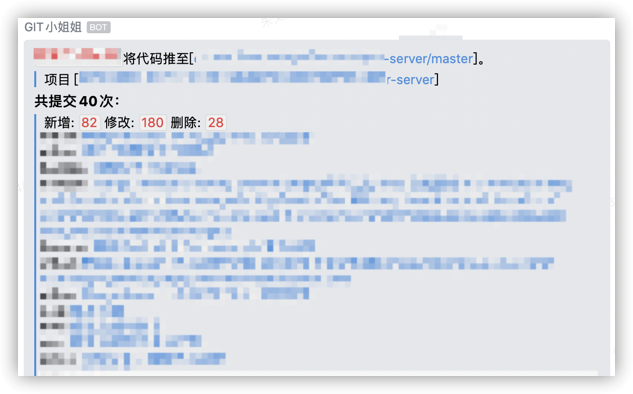
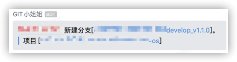
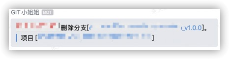
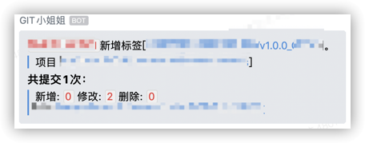
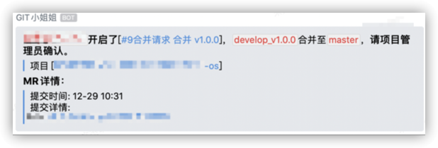
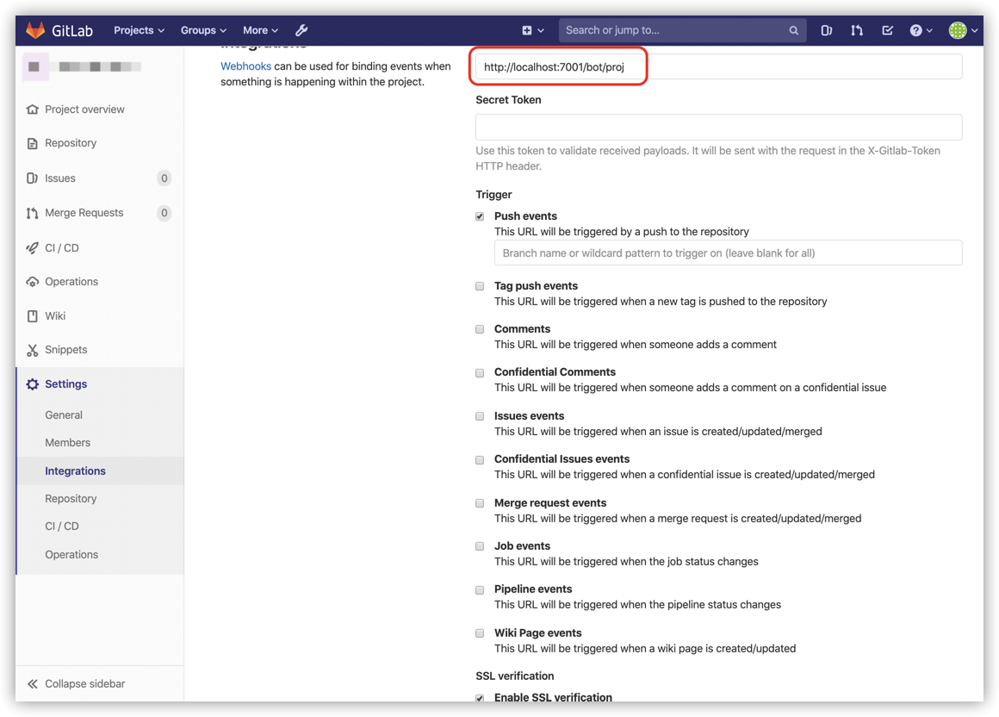

# Gitlab通知机器人

将`Gitlab`的`push`、`tag push`、`merge request`和`pipeline`推送到企业微信的机器人。

具体见下图：

Gitlab push 代码推送



Gitlab push 新建分支



Gitlab push 删除分支



Gitlab push tag 推标签



Gitlab merge request 合并请求



Gitlab pipeline 流水线


## 与企业微信对接

如何添加群机器人可自行百度。企业微[信群机器人配置说明](https://work.weixin.qq.com/api/doc/90000/90136/91770)。


## 应用部署运行

应用通过环境变量添加机器人webhook地址，`WEBHOOK_URL_`作为前缀，后面可接不同的推送组。

如环境变量`WEBHOOK_URL_PROJ`，`PROJ`则为推送组。推送组用于与`Gitlab`的集成时使用。

例如：
- 机器人的webhook地址为：https://qyapi.weixin.qq.com/cgi-bin/webhook/send?key=ABCDEFG
- 推送组为`PROJ`。

则环境变量设为：
```
WEBHOOK_URL_QYWX=https://qyapi.weixin.qq.com/cgi-bin/webhook/send?key=ABCDEFG
```

一个应用可以添加多个推送组。

### 使用Docker部署

修改`docker-compose.yml`文件中的`WEBHOOK_URL`环境变量，添加`企业微信机器人`的`webhook`地址。

```bash
docker-compose up -d
```

通过`:7001`端口访问服务。

### 直接运行

首先系统安装了`node`运行环境。

```bash
WEBHOOK_URL_PROJ=https://qyapi.weixin.qq.com/cgi-bin/webhook/send?key=ABCDEFG npm start
```

通过`:7001`端口访问服务。

## 与Gitlab集成

进到项目，`settings` => `integrations`。

URL填写服务的地址和端口号+推送组。

例如，服务器地址为：https://192.168.100.100:7001，推送组为PROJ。

URL填写：https://192.168.100.100:7001/proj

具体设置，参见下图：

